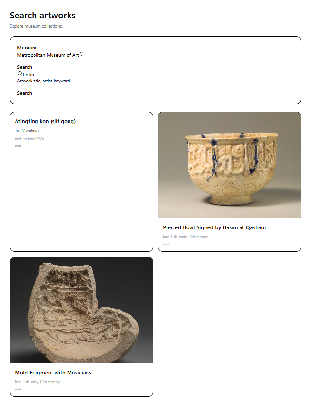
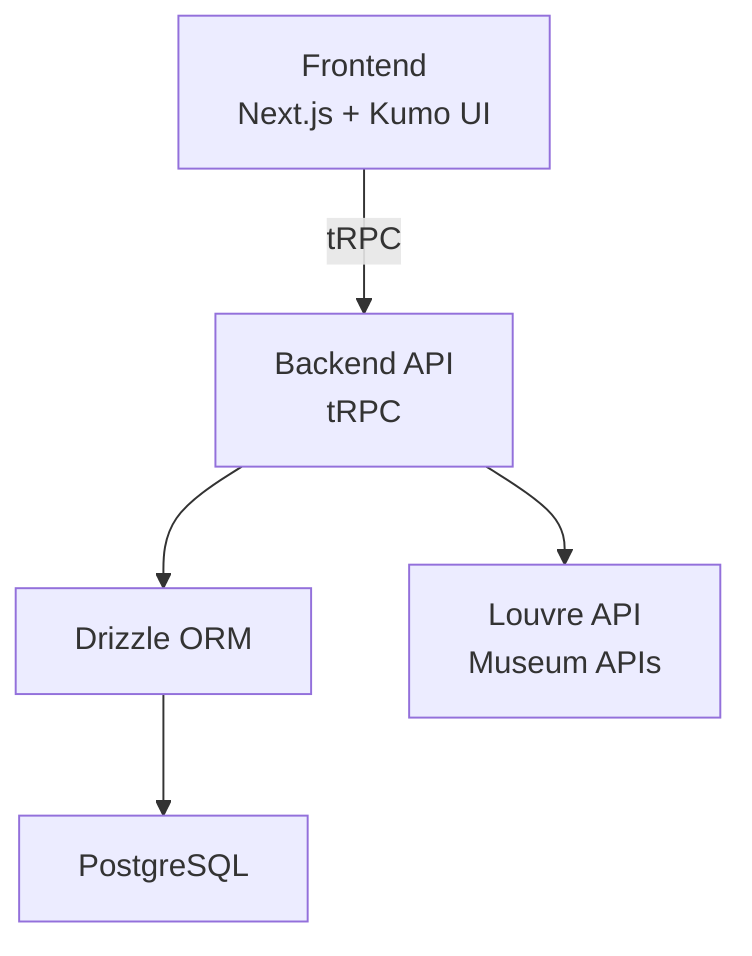
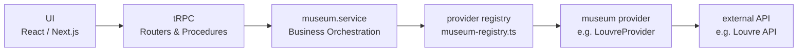
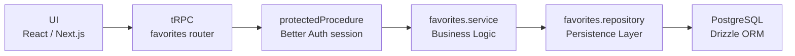

# mona-souvenir

[](https://react.dev/)
[](https://trpc.io/)
[](https://orm.drizzle.team/)
[](https://nextjs.org/)

A modern web application to explore museum artworks, save favorites, and build personal collections using public museum APIs such as the Louvre collections API.

## Features

- [x] Search artworks
- [ ] Artwork detail pages
- [ ] User authentication
- [ ] Persistent favorites
- [ ] Responsive gallery UI
- [ ] Search filters

### Illustrations

#### Search artworks

<p>
  
</p>

## Run Locally

1. Install a container manager (eg. `docker` or `podman`).
2. Run :

```bash
git clone https://github.com/Naedri/mona-souvenir.git
cd mona-souvenir
cp .env.example .env
docker compose up
```

## Tech Stack

| Layer                 | Selected Technology                       | Alternatives                   | Why This Choice                                                        |
| --------------------- | ----------------------------------------- | ------------------------------ | ---------------------------------------------------------------------- |
| Frontend Framework    | [Next.js](https://nextjs.org)             | Remix, Nuxt, SvelteKit         | Full-stack React ecosystem, routing, middleware, deployment simplicity |
| Backend Communication | [tRPC](https://trpc.io)                   | REST, GraphQL                  | End-to-end TypeScript safety and simpler frontend/backend integration  |
| Database              | [PostgreSQL](https://www.postgresql.org/) | MySQL, MongoDB                 | Reliable relational database for user data and favorites               |
| ORM                   | [Drizzle](https://orm.drizzle.team)       | Prisma, TypeORM                | Lightweight, SQL-oriented, excellent TypeScript support                |
| Authentication        | [Better Auth](https://better-auth.com/)   | Auth.js, Clerk                 | Modern self-hosted authentication with flexible architecture           |
| UI Components         | [Kumo](https://kumo-ui.com/)              | shadcn/ui, MUI, Ant Design     | Modern composable React components without copy-paste architecture     |
| Styling               | [Tailwind CSS](https://tailwindcss.com)   | Styled Components, CSS Modules | Fast UI development and consistent design system                       |

## Architecture



### Adding another museum

The application uses a provider-based architecture to isolate museum integrations from the rest of the system.

This allows the frontend, tRPC routers, favorites system, and database layer to remain completely independent from any specific museum API.



Each museum integration implements the same `MuseumProvider` interface.

This means adding a new museum only requires:

```txt
1 provider
1 mapper
1 client
1 registry entry
```

Example:

```txt
src/server/services/museums/
├── clients/
│   └── met.client.ts
├── mappers/
│   └── met.mapper.ts
├── providers/
│   └── met.provider.ts
└── registry/
    └── museum-registry.ts
```

The rest of the application remains unchanged.

### Saving a favorite

Favorites are protected resources linked to authenticated users.



The favorite flow is:

1. user clicks "favorite"
2. tRPC mutation is called
3. protectedProcedure validates session
4. favorites.service orchestrates logic
5. repository persists data
6. PostgreSQL stores favorite
